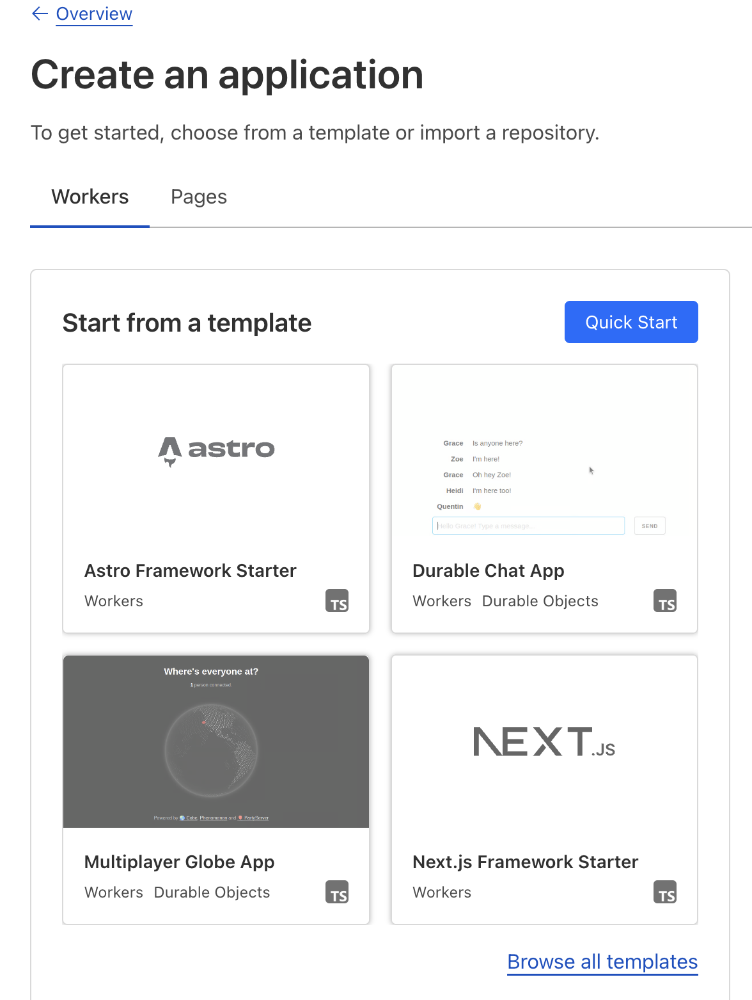
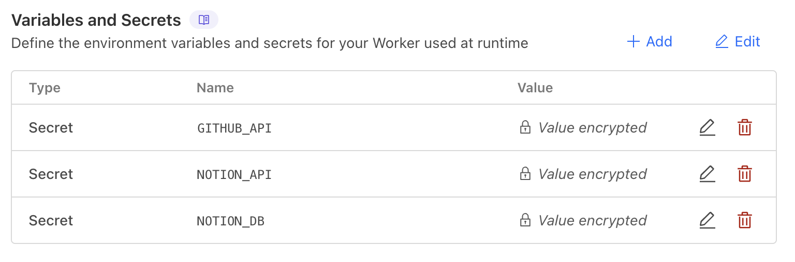
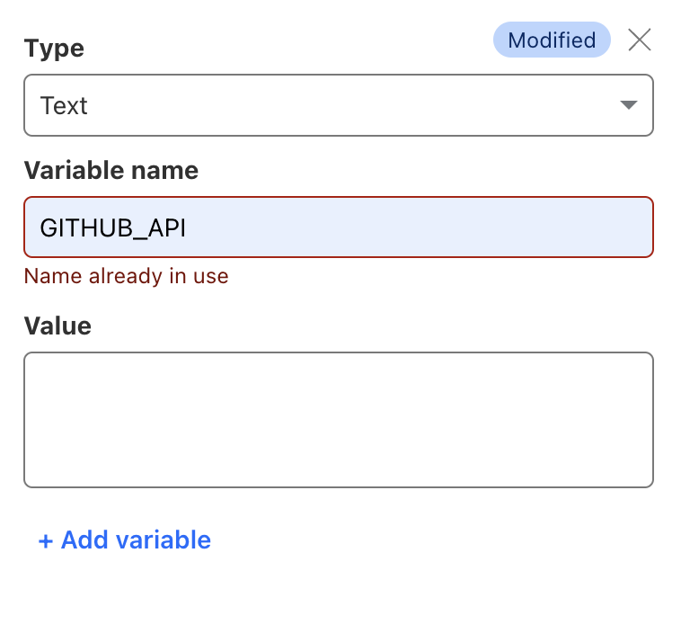
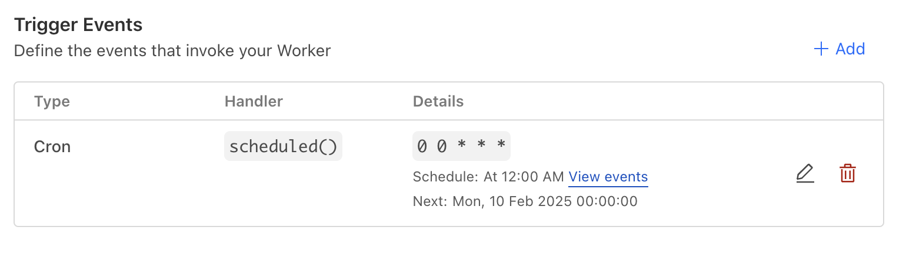
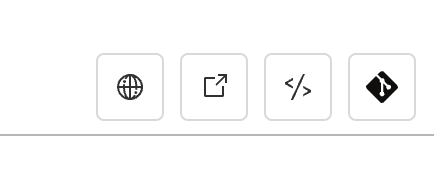
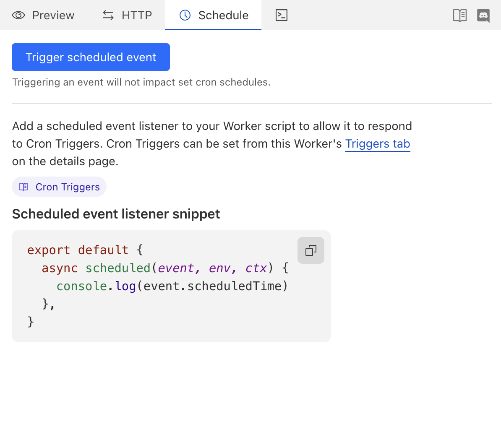

# notion DB 자동 업로드

## cloudflare workers에서 서버리스로 코드가 자동 실행되도록 한다.

### 백준 허브로 git repo에 push된 directory들을 이용한다.
https://github.com/BaekjoonHub/BaekjoonHub 참고

준비물 : 백준 허브를 사용하는 백준 문제 repository, notion db id, notion api, github api

notion api, notion db id를 얻는 방법은 해당 게시글 참고
https://wooncloud.tistory.com/131

github api
github.com/settings 에서 Developer settings 클릭

Settings -> Developer settings -> Fine-grained tokens -> generate_new_token 으로 새 토큰을 만든다.
필자는 모각소 기간 동안만 사용할 것이기 때문에 Expiration을 30일로 설정하였다.

다른 권한 없이 이름, 토큰 만료 날짜를 선택하고 토큰을 생성한다.

토큰이 생성되면 키가 보일텐데 다시 확인할 수 없으니 복사하고 은밀한 곳에 저장해두자.

cloudworkers_create.png

cloudworkers_cron.png

cloudworkers_edior.png

cloudworkers_first.png
cloudworkers_trigger.png
cloudworkers_variables.png
cloudworkers_variables_make.png

### Cloudflare workers

Cloudflare workers 가입

workers 생성(pages 아님)

처음에 hello world같은 코드가 뜰 텐데 그냥 deploy바로 해주면 된다.

settings에서 variables and Secrets추가

이름은 각각 GITHUB_API, NOTION_API, NOTION_DB로 하고 이름에 맞는 api key 및 id를 value에 추가

코드에서 GITHUB_API, NOTION_API, NOTION_DB이 변수명을 사용하기 때문에 변수명을 맞춰주는게 편하다.

secret이 보안에 좋아보여서 필자는 secret으로 했다.

settings에서 trigger Events 추가

cron triggers로 원하는 시간대 조정, 필자는 day of month로 지정했다. (최소 한 시간 이상으로 추천)

오른쪽 위에 코드 수정 클릭. "</>" 이렇게 생긴걸 눌러준다.

소스 코드를 집어넣고 자신의 handle, username에 맞게 수정한다.
헷갈리는 부분이 있으면 필자의 PS repository의 폴더구조 확인
https://github.com/syeobnn/PS/tree/main

코드를 수정했으면 오른쪽 위 deploy 버튼 클릭

deploy가 완료되면 Schedule에서 Trigger scheduled event 클릭

오른쪽 밑 콘솔에서 코드가 잘 작동되는지 확인하고 잘 안되면 api키나 백준 핸들 등을 바꿔보시길
